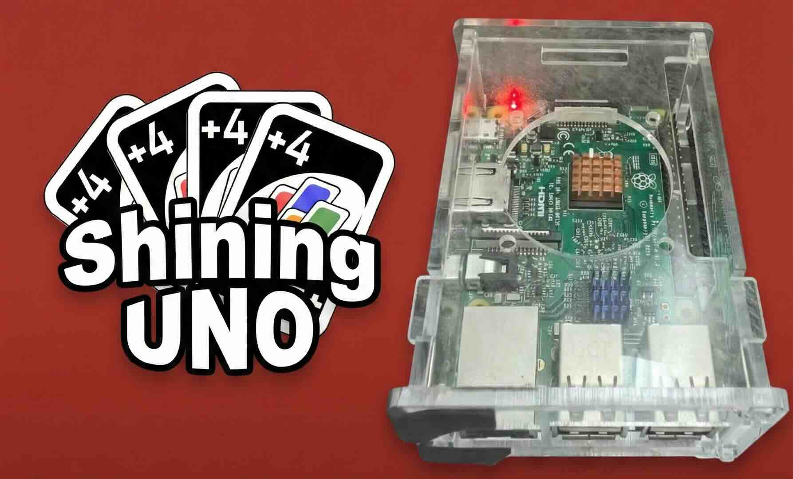

# Shining UNO Server
<p align="center">
  
</p>

<a name="chinese"></a>

**UNO Sever** 是一个用 C++ 编写的 UNO 纸牌游戏服务器。可部署运行在 **树莓派 (Raspberry Pi)** 上，兼容 macOS 和 Linux 环境。

该服务器利用异步 I/O 和事件驱动架构，通过 WebSocket 处理实时的多人游戏互动。

## ✨ 特性

*   **高性能**: 使用现代 C++ 构建，具有低延迟和高并发处理能力。
*   **WebSocket 支持**: 使用自定义 WebSocket 实现进行实时双向通信。
*   **持久化存储**: 集成 SQLite 用于用户数据和游戏状态的持久化。
*   **跨平台**: 通过 clang，gcc 编译测试。

## 🛠️ 构建与安装

### 前置要求
*   C++ 编译器 (要求 C++17)
*   CMake (3.10 或更高版本)
*   Git
*   OpenSSL (依赖)

安装 OpenSSL
Linux:
```bash
sudo apt-get install libssl-dev
# 检查安装是否成功
openssl --version
```
MacOS:
```bash
brew install openssl
# 检查安装是否成功
openssl --version
```

### 构建步骤

```bash
# 1. 克隆仓库
git clone https://github.com/AwayC/UnoServer.git
cd UnoServer

# 2. 创建构建目录
mkdir build
cd build

# 3. 配置并构建
cmake ..
make
```

## 🚀 使用方法
在 config.json 中配置端口，监听ip，jwt-key，数据库路径：
```json
{
  "port": 8081,
  "ip": "127.0.0.1",
  "secret": "123456",
  "db_url": "./uno_game.db3"
}
```

从回到config.json目录，运行编译好的可执行文件：
```bash
cd ..
./build/main
```

服务器将在配置的端口上启动监听（默认为 127.0.0.1:8081，请检查 `config.json`）。

## 📂 项目结构

*   `src/core`: 核心服务器组件。
*   `src/game`: 游戏逻辑。
*   `third-party`: 第三方库（WebSocket, SQLite 等）。

## 📚 API 文档

关于 HTTP 和 WebSocket API 的详细信息，请参阅 [Uno Game API.md](./Uno%20Game%20API.md)。